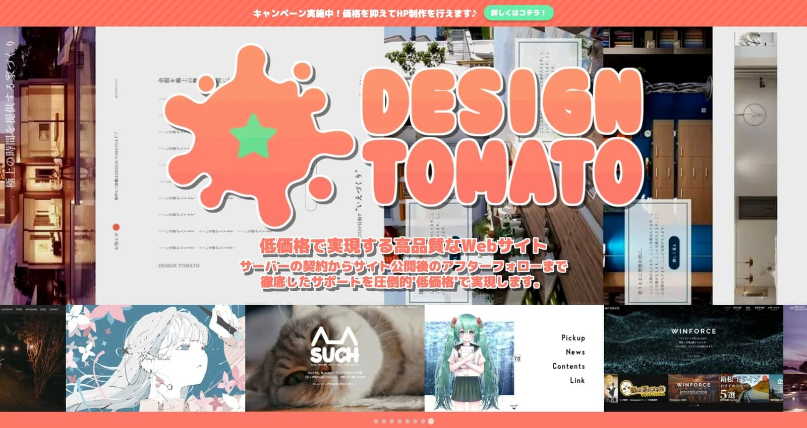

# Wordpress theme by DesignTomato
## テーマ概要
＞ [DESIGN TOMATO](https://design-tomato.com/)

このWordPressテーマは自身が運営しているWeb制作会社『DESIGN TOMATO』の専用テーマです。

Webからの制作依頼を受け付ける窓口としてこのサイトを制作しました。

内部SEOやパフォーマンスUP以外にも、デザインにこだわって制作しています。

ポップで楽しくなるような華やかなデザインにしました。

&nbsp;
 - - -
&nbsp;

## 使用技術
### ワイヤーフレーム
- [AdobeXD](https://xd.adobe.com/view/ff9e7e2f-618b-4443-a811-a20877c96375-aacd/) (サイトマップ/ワイヤーフレーム)

### 開発環境
- MAMP v5.7
- Node.js v18.12.1

### 使用言語
- HTML
- SCSS / CSS
- TypeScript / JavaScript
- PHP

### その他
- CSSフレームワーク > TailWindCSS
- CSS設計 > FLOCSS
- CSSプロパティ記述順 > [mozilla.org Base Styles](https://qiita.com/akuden/items/e9c91a7a2b0596d53fd1) (視覚順)
- Webpack
- Git / GitHub
- Gitmoji

&nbsp;
 - - -
&nbsp;

### 開発方法
MAMPを使用してローカルに仮想サーバーを構築し、Node環境で開発。

TypeScriptのコンパイルは"Webpack","ts-loader"を使用。

開発用ファイルは"src"フォルダに格納、本番用ファイルは"dist"フォルダに格納。

&nbsp;

開発用フォルダ内のSCSSから自動生成されるCSSを"copy-webpack-plugin"を使用し、

ビルド時に自動的に本番用フォルダ内にコピーされるようにしています。

これにより必要のないSCSSファイルを本番用に含めないようにしています。

&nbsp;

本番環境へのアップロードは"dist"フォルダを圧縮するだけで

そのままアップロードする事ができるので、快適に制作をしつつ、必要最低限のファイルのみでテーマを制作できるようにしています。